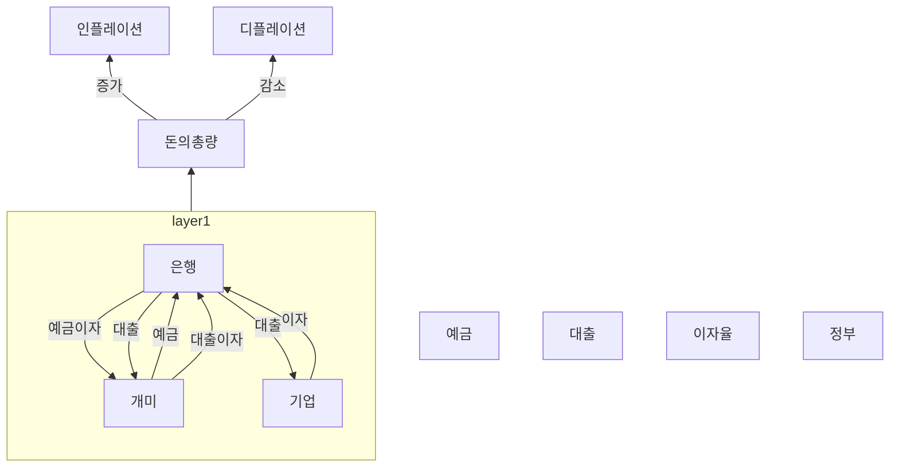
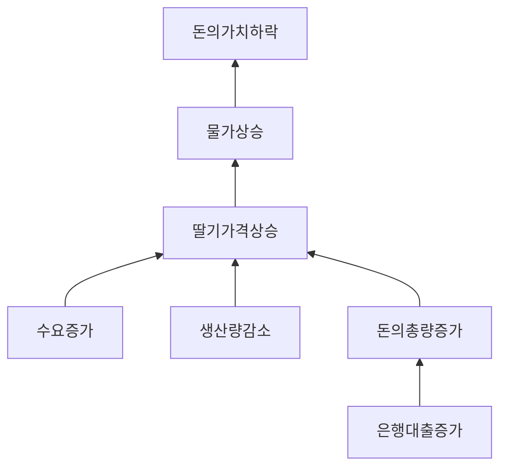
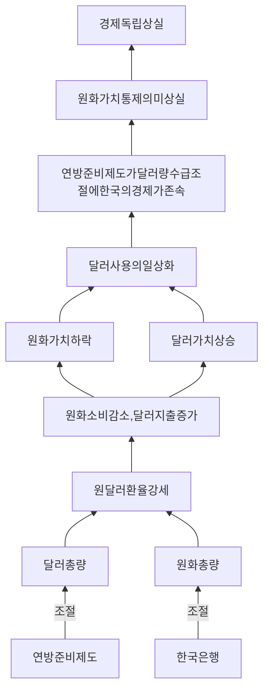
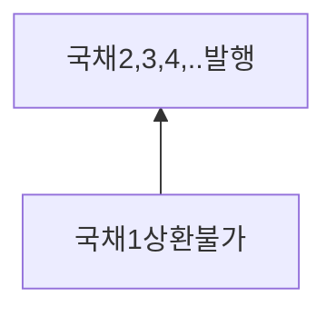
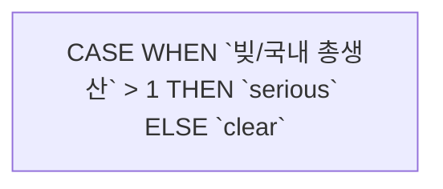

## 물가가 오르는 이유는 무엇인가요?



## 왜 다른 나라 돈을 우리나라에서는 사용할 수 없을까요?



## 개인,회사,국가는 각각 어떻게 돈관리를 해야할까요?

```mermaid
graph BT
subgraph 국가
소득=세금
지출=정부운영,공공사업..
end
```

## 한 사람의 신용은 어떻게 정해지나요?

```mermaid
graph BT


subgraph 자산=개인,기업,국가
var1[자본>부채]
var2[자본<부채]
end

subgraph 빅데이터=개인,기업,국가
연체없는상환
큰비용의상환
end

var1-->|posive|갚을능력
var2-->|negative|갚을능력
연체없는상환-->|사례많음|갚을의지
큰비용의상환-->|사례많음|갚을의지
갚을능력-->신용
갚을의지-->신용
신용

```

## 국가는 어떻게 돈을 빌릴까요?

### 일반

 ```mermaid
graph BT

subgraph 신용
국가
개인
기업

개인-->|세금|국가
기업-->|세금|국가
end

subgraph 국가사업
국가-->국채

end

subgraph 투자
투자자
국채-->투자자

end
 ```

### 변형



### 국가의 빚 측정방법



## 회가 빚을 갚지 못하면 어떻게 되나요? 

### 자본주의 시스템의 본질

